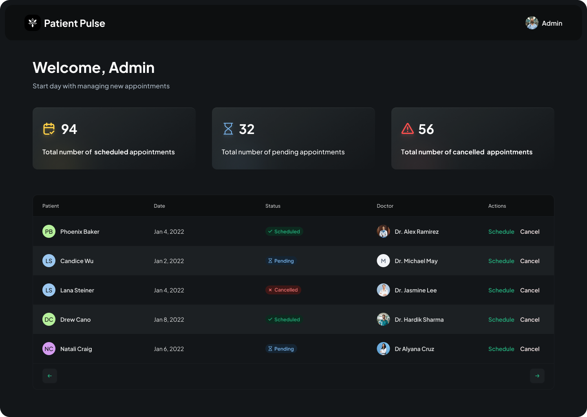

# Patient Pulse - Modern Healthcare Management System



Patient Pulse is a modern, user-friendly healthcare management system built with Next.js 15, TypeScript, Tailwind CSS, and Shadcn UI components. It streamlines the patient onboarding process and appointment management, providing a seamless experience for both patients and healthcare providers.


## Key Features

### For Patients

- 🏥 Easy appointment scheduling
- 📝 Streamlined registration process
- 📅 Appointment management
- 📱 Responsive design for all devices

### For Healthcare Providers

- 📊 Comprehensive dashboard
- 👥 Patient management
- 📅 Appointment tracking
- 🔒 Secure data handling

## Technical Stack

- **Frontend**: Next.js 15.1, React 19, TypeScript
- **UI Components**: Shadcn UI
- **Styling**: Tailwind CSS
- **Backend**: Appwrite
- **Form Handling**: React Hook Form, Zod validation
- **State Management**: React Server Components

## Project Structure

```
src/
├── app/             # Next.js 15 App Router
├── components/      # Reusable UI components
├── lib/             # Core utilities and helpers
└── types/           # TypeScript definitions
```

## Development Practices

- ✅ TypeScript for type safety
- 🎨 Modern, responsive UI design
- ♿ Accessibility compliance
- 🔄 Server-side rendering
- 📱 Mobile-first approach

## Screenshots

### Dashboard View


_Comprehensive dashboard for healthcare providers_

### Patient Onboarding


_Streamlined patient registration process_

---

Built with ❤️ using Next.js and TypeScript
